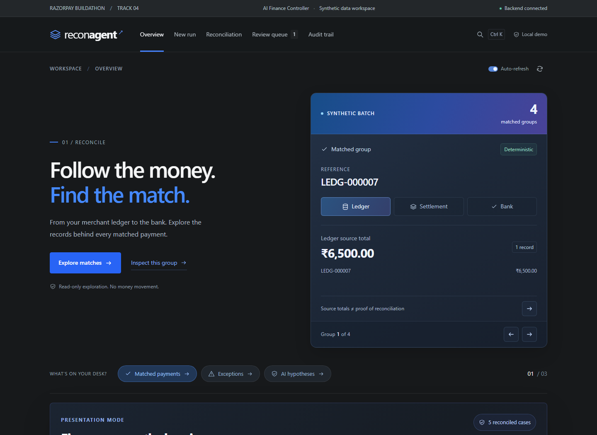
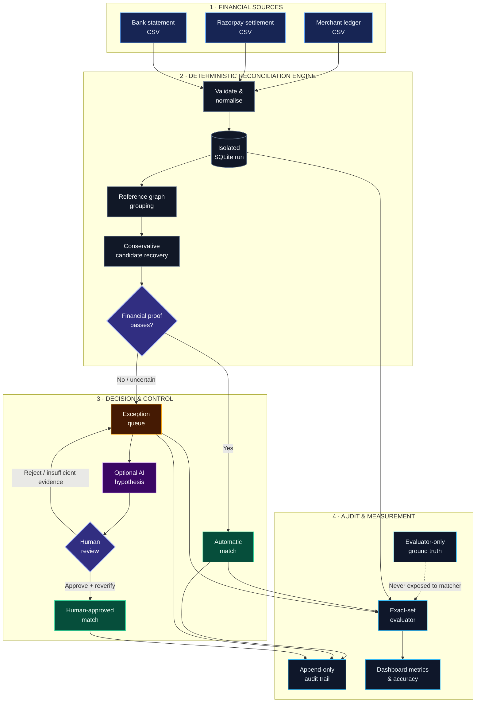
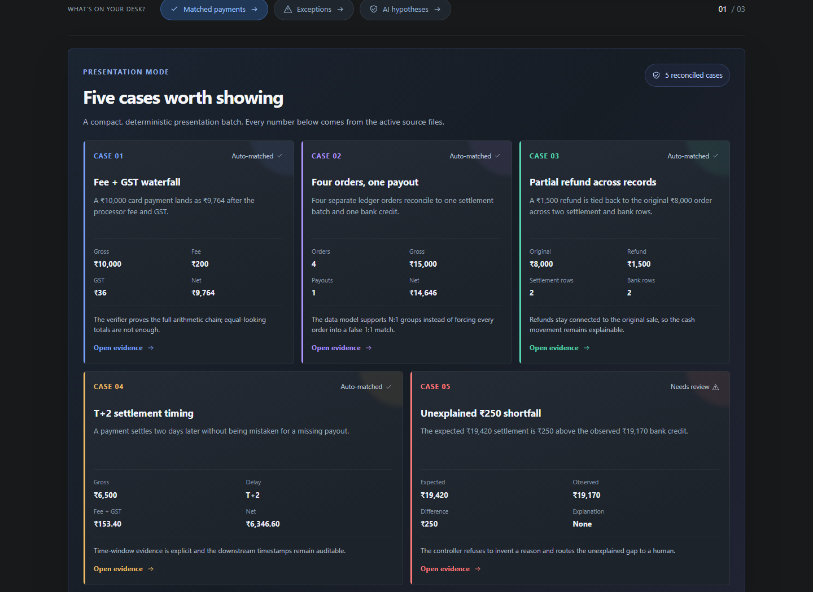
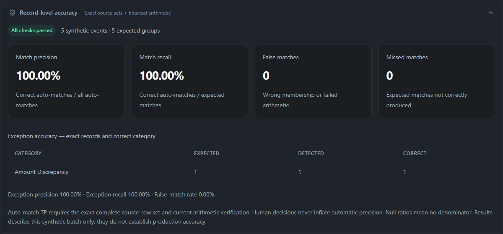

# ReconAgent — AI Finance Controller

> A verification-first reconciliation workspace for merchant ledgers, payment settlements, and bank statements.

ReconAgent was built for the **Razorpay Buildathon — Track 04: AI Finance Controller**. It closes a complete finance-operations loop over synthetic data: ingest three independent financial sources, normalize them, connect related records, verify the money movement, surface unresolved exceptions, assist investigation, preserve human control, and report measured accuracy.

The central product principle is simple:

**AI may propose an explanation. It never gets to invent financial evidence or silently close the books.**



## Table of contents

- [The problem](#the-problem)
- [The solution](#the-solution)
- [What makes this different](#what-makes-this-different)
- [Architecture](#architecture)
- [How reconciliation works](#how-reconciliation-works)
- [Product experience](#product-experience)
- [Verified results](#verified-results)
- [Quick start](#quick-start)
- [Demo modes](#demo-modes)
- [CSV input contract](#csv-input-contract)
- [API](#api)
- [Testing](#testing)
- [Project structure](#project-structure)
- [Configuration](#configuration)
- [Safety and privacy](#safety-and-privacy)
- [Limitations and production roadmap](#limitations-and-production-roadmap)

## The problem

Finance teams often need to reconcile three versions of the same commercial event:

1. The **merchant ledger** records the order and customer-facing amount.
2. The **payment settlement report** records processor fees, GST, refunds, batches, and net settlement.
3. The **bank statement** records the cash that actually arrived or left.

These sources rarely line up as clean 1:1 rows. Real reconciliation work includes:

- processor fees and GST;
- T+1 or T+2 settlement timing;
- many orders combined into one payout;
- refunds split across later settlement cycles;
- duplicate records;
- missing ledger, settlement, or bank entries;
- malformed or missing references;
- two equally plausible candidates;
- genuine unexplained cash differences.

Matching rows by amount alone is unsafe. Reporting a high match count without proving record membership and arithmetic is also unsafe. Finance operations need throughput, measurable accuracy, and an honest exception list.

## The solution

ReconAgent provides a local workspace that:

- accepts ledger, settlement, and bank CSV files;
- converts all monetary values to integer paise;
- creates exact reference-linked groups, including N:1 batches and split refunds;
- conservatively recovers some broken-reference 1:1:1 groups;
- independently recomputes expected settlement values;
- creates automatic matches only after verification succeeds;
- classifies unresolved groups into specific exception categories;
- allows optional AI investigation of amount discrepancies and ambiguous candidate sets;
- requires explicit human review before any AI-assisted case can become a match;
- writes append-only application audit events;
- measures exact match precision, recall, false-match rate, and exception accuracy against evaluator-only ground truth;
- creates isolated runs without deleting previous datasets or decisions.

## What makes this different

### Verification before automation

The matching engine does not treat connected references as proof. A complete group must also pass independent financial and lifecycle checks.

For a group of ledger, settlement, and bank records:

```text
expected settlement = ledger gross − declared fee − declared GST − merchant-declared refunds
```

ReconAgent then verifies all of the following:

- ledger gross equals settlement-reported gross;
- merchant and settlement refund totals agree;
- every settlement row satisfies its own gross/fee/GST/net formula;
- aggregate settlement net equals independently expected net;
- bank total equals settlement total;
- bank total equals independently expected net;
- all rows use the supported INR lifecycle;
- downstream timestamps do not predate the merchant order;
- duplicate source references and suspicious duplicate bank postings remain exceptions.

All calculations use integer paise. The synthetic contract allows at most **5 paise** of rounding drift; opposing errors cannot cancel because each arithmetic leg is checked separately.

### Conservative broken-reference recovery

Fallback candidate recovery is deliberately narrower than exact-reference reconciliation. It only considers incomplete, captured, positive-value INR components with at most one row from each source.

A candidate must satisfy hard amount and timing windows, contain no contradictory metadata, and pass the full financial verifier. Automatic recovery additionally requires:

- at least **90 rule points**;
- verified ledger and bank identity evidence;
- a lead of at least **10 points** over every overlapping alternative;
- no reuse of a source record already claimed by another accepted group.

The rule score is not an LLM confidence or calibrated probability. Amount and timing alone never establish identity. Close candidates remain an `ambiguous_candidate` exception.

See [CANDIDATE_MATCHING.md](CANDIDATE_MATCHING.md) for the complete scoring and adversarial test design.

### AI is intentionally downstream

The deterministic engine performs normalization, grouping, arithmetic, and initial classification. AI is available only for open amount discrepancies and ambiguous candidate sets. Amount cases receive a structured hypothesis from numeric and timing evidence. Candidate cases receive a conservative assessment of an anonymized signal matrix so the model can explain which identity evidence is missing or tied—but it is forced to leave identity unresolved.

AI cannot:

- create an automatic match;
- alter source records;
- bypass arithmetic verification;
- resolve an ambiguous candidate set;
- overwrite a completed human review;
- perform a payout, refund, journal entry, or other money movement.

Mock mode is visibly labelled and makes no model call. Live mode is optional and was not used to establish the reported benchmark accuracy.

## Architecture



The matcher and verifier remain fully deterministic. AI is only an investigation aid after a case has already been
withheld, and every approval is reverified by the backend before it can change reconciliation state.

### Trust boundaries

- **Ground truth is evaluator-only.** Matching and candidate modules never import or read it.
- **Showcase metadata is post-run.** The five-case presentation manifest is created only after reconciliation and cannot influence decisions.
- **Frontend actions are not trusted.** Review approval reruns backend verification and uses optimistic concurrency checks.
- **Existing runs are preserved.** Pipelines require a new empty database, and uploaded files are staged in a new UUID directory.

### Technology

| Layer | Technology | Responsibility |
| --- | --- | --- |
| Frontend | React 19, Vite 8 | Dashboard, source explorer, review workflow, uploads, evidence views |
| Visualization | Recharts | Bank activity and reconciliation summaries |
| API | FastAPI, Pydantic | Validated HTTP contracts and review endpoints |
| Persistence | SQLite, SQLAlchemy | Transactions, N:M groups, decisions, users, and audit events |
| Matching | Python | Reference graph, candidate search, classification, arithmetic verification |
| Optional AI | Google GenAI provider | Structured hypotheses for amount gaps and non-decisive assessments of candidate ambiguity |
| Evaluation | Python | Exact source-set TP/FP/FN and financial validation |

## How reconciliation works

### 1. Ingest and normalize

Each source has its own parser because financial exports use different conventions:

- ledger amounts are rupee-formatted strings;
- settlement values are integer paise;
- bank values may be decimal rupees or raw paise;
- four supported date formats are normalized to UTC;
- unknown statuses and malformed values fail the run with a source row number.

All accepted records become canonical `Transaction` rows with their untouched source payload retained for evidence.

### 2. Build exact reference groups

ReconAgent builds a graph from ledger references, settlement payment references, payout batches, and references extracted from bank descriptions. Union-find turns connected rows into indivisible source groups.

The N:M database model supports:

- one ledger + one settlement + one bank;
- many ledger orders + one batch settlement + one bank credit;
- one order + sale and refund settlement rows + matching bank movements.

### 3. Recover bounded candidates

Incomplete eligible groups enter an indexed amount-window search. Candidate assignments are filtered by currency, lifecycle, amount, timing, order/customer/payment-method conflicts, and payout/batch conflicts. Every survivor is rerun through the same arithmetic verifier.

Search is fail-closed. More than 100 amount neighbors or 10,000 combinations disables automatic fallback rather than allowing truncation to manufacture a winner.

### 4. Verify every money leg

The verifier classifies a group as:

- deterministic match;
- fuzzy rounding-tolerance match;
- missing ledger;
- missing settlement;
- missing bank credit;
- duplicate;
- amount discrepancy;
- timing discrepancy;
- refund mismatch;
- currency mismatch;
- ambiguous candidate;
- unknown adjustment.

### 5. Persist decisions and evidence

Matches and exceptions are stored with their exact transaction membership. The system also writes the rule version, arithmetic values, timing evidence, candidate policy, and explanation to the audit trail.

### 6. Investigate and review

Analysts can inspect all linked records, compare candidate alternatives, bookmark locally, and submit a documented decision. Approval is blocked when arithmetic remains invalid or candidate identity remains unresolved.

### 7. Evaluate honestly

The evaluator compares each emitted source-row set with private expected sets and reports:

- true positives, false positives, and false negatives;
- match precision and recall;
- false-match rate;
- exception precision, recall, and category correctness;
- financial validation failures;
- missing, unexpected, or duplicate source references;
- results created under an older rule version.

Human decisions never inflate automatic-match accuracy.

## Product experience

The workspace includes:

- **Overview:** group metrics, merchant value coverage, bank activity, exception mix, match methods, and record-level accuracy.
- **Presentation mode:** five judge-ready cases that open their real reconciliation evidence.
- **New run:** drag-and-drop ledger, settlement, and bank CSVs, validate them, then reconcile into a new isolated database.
- **Reconciliation:** searchable, sortable, filterable automatic match explorer.
- **Review queue:** prioritized unresolved cases, AI investigation, candidate comparison, and guarded human decisions.
- **Audit trail:** system, AI, and human events with stored evidence.
- **Command menu:** keyboard navigation and quick record access.
- **Exports and bookmarks:** local exploration tools that never perform a financial action.



## Verified results

### Five-case judge showcase

The deterministic presentation dataset contains 20 source records and five business groups:

| Case | Expected behavior | Result |
| --- | --- | --- |
| ₹10,000 fee + GST waterfall | Auto-match at ₹9,764 net | Correct match |
| Four orders → one payout | N:1 auto-match at ₹14,646 net | Correct match |
| ₹1,500 partial refund | Link sale and refund lifecycle | Correct match |
| T+2 settlement | Accept valid delayed posting | Correct match |
| ₹250 unexplained shortfall | Keep unresolved for review | Correct exception |

| Evaluation measure | Result |
| --- | ---: |
| Source records | 20 |
| Expected groups | 5 |
| Correct automatic matches | 4 |
| Correct exceptions | 1 |
| Match precision | 100% |
| Match recall | 100% |
| Exception precision | 100% |
| Exception recall | 100% |
| False matches | 0 |
| Missed matches | 0 |



These percentages describe the deterministic synthetic showcase only. They are not a claim of production accuracy.

### Full 200-event benchmark

The recorded seed-42 benchmark covers all 17 scenario families:

| Measure | Result |
| --- | ---: |
| Source records | 700 |
| Business groups | 200 |
| Correct automatic matches | 159 |
| Correct exceptions | 41 |
| Missing-reference recoveries | 10 |
| Corrupted-reference recoveries | 6 |
| Genuine ambiguity cases withheld | 11 |
| Amount-only candidates withheld | 5 |
| False / missed matches | 0 / 0 |
| Match precision / recall | 100% / 100% on this synthetic batch |
| Automatic group coverage | 79.5% |
| Merchant gross value coverage | 79.51% |

The important figure is not only the match rate: the engine correctly withholds cases where identity or arithmetic is insufficient.

## Quick start

### Prerequisites

- Python 3 with `venv`
- Node.js and npm
- PowerShell commands below are written for Windows

### Install

From the project root:

```powershell
py -m venv venv
.\venv\Scripts\python.exe -m pip install -r backend\requirements-dev.txt
npm.cmd --prefix frontend ci
```

### Start the recommended showcase

```powershell
npm.cmd run showcase
```

Open:

- Dashboard: [http://localhost:5173/#dashboard](http://localhost:5173/#dashboard)
- API documentation: [http://127.0.0.1:8000/docs](http://127.0.0.1:8000/docs)

Keep the terminal open. Press `Ctrl+C` to stop both local services.

The launcher creates a fresh verified database under `backend/showcase-runs/`, forces AI to mock mode, and preserves every previous run.

## Demo modes

| Command | Purpose |
| --- | --- |
| `npm.cmd run showcase` | Create and serve the five canonical judge cases |
| `npm.cmd run demo` | Create and serve a fresh 200-event, 17-scenario benchmark |
| `npm.cmd run dev` | Serve the existing configured local database |
| `npm.cmd run evidence` | Capture 11 fallback screenshots and bundle the active showcase report |
| `npm.cmd run build` | Build the production frontend assets |

For the recommended presentation order and talking points, read [DEMO.md](DEMO.md).

### Capture an offline fallback

With `npm.cmd run showcase` still running in one terminal, run this in another:

```powershell
npm.cmd run evidence
```

The timestamped directory under `demo-evidence/` contains:

- overview and five-case screenshots;
- one evidence-dialog screenshot per canonical case;
- accuracy, review queue, audit trail, and upload screenshots;
- the exact evaluator report for the captured run;
- the showcase manifest and presentation notes.

## CSV input contract

The **New run** workspace requires exactly one file for each source.

| File | Required columns |
| --- | --- |
| Ledger | `ledger_ref`, `order_id`, `customer_id`, `amount`, `order_date`, `status` |
| Settlement | `settlement_ref`, `payment_ref`, `gross_amount_paise`, `fee_paise`, `gst_paise`, `net_amount_paise`, `settlement_date`, `batch_id`, `status` |
| Bank | `bank_ref`, `credit_amount`, `value_date`, `description` |

Local MVP limits:

- `.csv` files only;
- maximum 2 MB per source;
- maximum 10,000 rows per source;
- duplicate headers rejected;
- every row validated before a run directory is created;
- exactly one ledger, settlement, and bank file required;
- uploaded text remains on the local machine in an isolated UUID run folder.

## API

The Vite frontend proxies `/api` to the FastAPI service.

| Method | Endpoint | Purpose |
| --- | --- | --- |
| `GET` | `/health` | Service and active-run status |
| `GET` | `/demo-cases` | Optional post-run showcase metadata |
| `POST` | `/import-runs/preview` | Validate and stage three CSV sources |
| `GET` | `/import-runs/{run_id}` | Read isolated run status |
| `POST` | `/import-runs/{run_id}/reconcile` | Execute and activate a staged run |
| `GET` | `/matches` | Paginated/filterable match list |
| `GET` | `/matches/{match_id}` | Match evidence and exact transactions |
| `GET` | `/exceptions` | Paginated/filterable exception list |
| `GET` | `/exceptions/{exception_id}` | Exception, transactions, hypothesis, and system evidence |
| `POST` | `/exceptions/{exception_id}/review` | Guarded human approval or rejection |
| `GET` | `/metrics` | Unique-group and merchant-value metrics |
| `POST` | `/run-ai-reasoning` | Explicitly investigate open amount discrepancies and ambiguous candidates |
| `GET` | `/audit-log` | Filterable application audit events |
| `GET` | `/eval-scores` | Exact-set and arithmetic evaluation |

Interactive request/response schemas are available from the local `/docs` endpoint.

## Testing

Run all checks from the project root:

```powershell
.\venv\Scripts\python.exe -m unittest discover -s backend\tests -v
npm.cmd --prefix frontend test
npm.cmd --prefix frontend run lint
npm.cmd run build
```

Current verified suite:

- **59 backend tests passed**;
- **40 frontend tests passed**;
- frontend production build passed;
- all five showcase cases passed exact-set evaluation;
- full scenario regressions passed for seeds 42, 7, and 2026;
- tests use disposable databases and no external AI calls.

Coverage includes malformed money, date and status inputs; duplicate rows; missing sources; fee/GST errors; refunds; currency and lifecycle errors; backwards timing; wrong group membership despite equal counts; broken references; metadata conflicts; close candidate scores; shared bank claims; bounded search; stale and concurrent reviews; AI/human races; forced rejection of AI-selected candidate identities; upload limits; path traversal; isolated activation; evaluator-only truth; and private-field exclusion from AI and the frontend.

The frontend linter completes with zero warnings and zero errors. The production build is split into application, React, and chart chunks so no oversized-chunk warning is emitted.

## Project structure

```text
recon-agent/
├── backend/
│   ├── app/
│   │   ├── main.py                    # FastAPI routes and guarded review transaction
│   │   ├── models/db.py               # SQLite/SQLAlchemy model
│   │   ├── schemas.py                 # API contracts
│   │   └── services/
│   │       ├── ingestion.py           # Source-specific normalization
│   │       ├── matching.py            # Exact reference graph and persistence
│   │       ├── candidates.py          # Conservative broken-reference recovery
│   │       ├── verification.py        # Integer-paise financial proof
│   │       ├── ai_reasoning.py        # Mock/live hypothesis layer
│   │       ├── evaluation.py          # Evaluator-only exact-set scoring
│   │       ├── metrics.py             # Group and merchant-value metrics
│   │       ├── import_runs.py         # Validated isolated CSV staging
│   │       └── pipeline.py            # Reusable new-database pipeline
│   ├── scripts/
│   │   ├── generate_synthetic_data.py
│   │   ├── prepare_demo.py            # 200-event benchmark
│   │   ├── prepare_showcase.py        # Five canonical presentation cases
│   │   ├── run_pipeline.py
│   │   └── eval_quick.py
│   └── tests/                          # Offline reconciliation regressions
├── frontend/
│   └── src/
│       ├── App.jsx
│       ├── api.js
│       ├── components/                 # Dashboard, upload, review, evidence, audit UI
│       └── lib/                        # Tested presentation and data helpers
├── scripts/
│   ├── dev.mjs                         # Two-service local launcher
│   └── capture-evidence.mjs            # Repeatable screenshot/evidence capture
├── docs/images/                        # README screenshots
├── CANDIDATE_MATCHING.md
├── DEMO.md
└── package.json
```

## Configuration

| Variable | Meaning |
| --- | --- |
| `RECON_DATA_DIR` | Active source and evaluator-truth directory |
| `RECON_DB_PATH` | Active SQLite database path |
| `RECON_IMPORT_ROOT` | Isolated uploaded-run directory; defaults to `backend/import-runs` |
| `RECON_AI_MODE=mock` | Guarantees that AI investigation makes no provider call |
| `GEMINI_API_KEY` | Enables the optional live provider outside forced mock mode |
| `GEMINI_MODEL` | Selects the optional live model |

Never place API keys in frontend code, committed files, screenshots, or demo recordings.

## Safety and privacy

- The recommended showcase is entirely synthetic.
- Mock mode sends nothing to an AI provider.
- No frontend analytics or external fonts are used.
- Uploaded CSVs are stored locally and are never uploaded by the application to a cloud service.
- Exploring, filtering, bookmarking, and exporting records cannot move money.
- AI receives only bounded numeric/timing evidence or an anonymized candidate signal matrix in optional live mode—not references, record IDs, source rows, customer data, or evaluator ground truth.
- Review notes are required, status is checked for stale writes, and approval reruns verification.
- Source correction requires a new run; the application does not rewrite financial evidence to force a match.
- The API is an unauthenticated development service and must not be exposed publicly.

## Limitations and production roadmap

ReconAgent is a buildathon MVP, not production-ready finance software.

Current boundaries:

- synthetic feed contracts rather than live Razorpay, ERP, and bank integrations;
- declared fee/GST evidence rather than independently versioned commercial tariff validation;
- INR-only financial verification and no FX netting;
- bounded broken-reference recovery for captured 1:1:1 components;
- exact-reference paths still required for refund chains and N:1 batches;
- application-level append-only auditing, not cryptographic or infrastructure-level immutability;
- no authentication, enforced RBAC, multi-tenant isolation, secrets manager, or production authorization model;
- no production object storage, malware scanning, background queue, observability, alerting, or durable run selection;
- no automatic accounting entry, refund, payout, or bank action;
- live-model quality and availability have not been benchmarked;
- synthetic evaluation demonstrates implementation correctness on known scenarios, not production accuracy.

The production path would add signed source connectors, schema/version registries, authenticated tenant isolation, versioned tariff policies, durable object storage and queues, reviewer roles and dual control, tamper-evident audit storage, monitoring, replayable jobs, calibrated model evaluation, and staged deployment controls.

## Buildathon takeaway

ReconAgent demonstrates an AI Finance Controller that knows when **not** to automate. It combines high-throughput deterministic processing with exact financial proof, measurable evaluation, explainable candidate recovery, AI-assisted investigation, and a human-controlled exception loop.

**Throughput matters. Accuracy matters more. An honest exception is better than a confident false match.**
